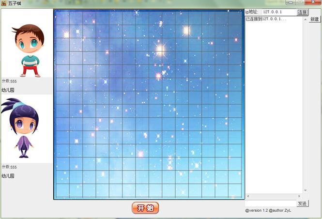

Introduction
----
A multiplayer C/S Game Uses `Swing` & `Socket(TCP/IP)`

I have write this project in my first year at university...

This project use TCP protocal to connect each other,two sides
can create a server and wait to be connected...

Win:chess pieces in a row.

Galance
---
